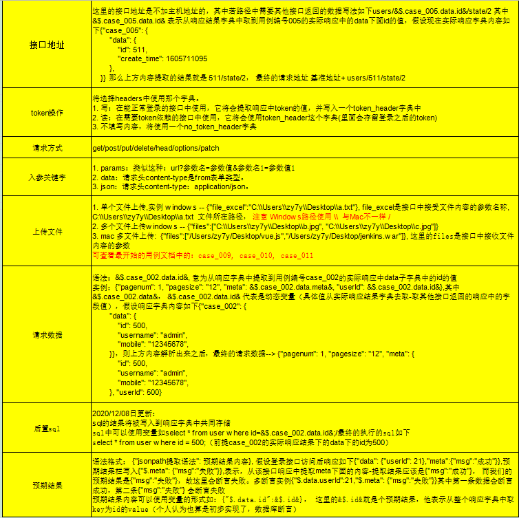
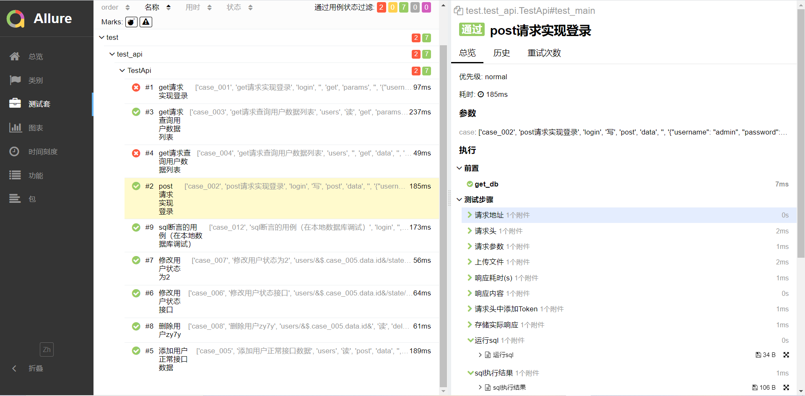

# apiAutoTest

#### 介绍
#### 软件架构
| 名称       | 版本   | 作用 |
| -------- | -------- | ---- |
| python                         | 3.7.8  |      |
| pytest                         | 6.0.1  | 底层单元测试框架,用来实现参数化，自动执行用例 |
| allure-pytest                  | 2.8.17 | allure与pytest的插件可以生成allure的测试报告 |
| jsonpath                       | 0.82   | 用来进行响应断言操作 |
| loguru                         | 0.54   | 记录日志 |
| PyYAML                         | 5.3.1  | 读取yml/yaml格式的配置文件 |
| Allure 												 | 2.13.5 | 要生成allure测试报告必须要在本机安装allure并配置环境变量 |
| xlrd                           | 1.2.0  | 用来读取excel中用例数据 |
| yagmail | 0.11.224 | 测试完成后发送邮件 |
| requests| 2.24.0 | 发送请求 |
|pymysql|0.10.1|连接mysql|
#### 目录结构
>apiAutoTest
>
>> .pytest_cache(文件夹): pytest运行测试文件的时候产生的文件
>>
>> api(包)：主请求
>>
>> > `__init__`.py
>> >
>> > base_requests.py: 封装了get、post、put、delete等接口请求
>>
>> config(文件夹)： 配置文件
>>
>> > config.yaml: 脚本配置文件（sever、提取规则）
>>
>> data(文件夹) 用例数据
>>
>> > case_data.xlsx: 测试用例
>>
>> ~~image(文件夹)~~
>>
>> > ...: gitee仓库中使用的静态文件资源
>>
>> log 日志文件
>>
>> > 运行日志文件.....: 运行代码时，脚本中打印的日志会存到这里。
>>
>> report(文件夹) 测试报告文件
>>
>> > data ： 每次执行测试用例的结果，存在这里
>> >
>> > html： 使用了allure 的一个命令，生成的本地可视化的一个html报告
>>
>> test(包): 运行文件所在包
>> > conftest.py: 存放可用于整个测试目录的方法 （2020/12/08 +）
>> > test_api.py：Pytest 命令可直接运行的测试文件，里面是我们的主函数
>>
>> tools(包): 工具包
>>
>> >`__init__.py`
>> >
>> >data_process.py：封装依赖数据与请求数据的逻辑处理，处理了path参数依赖，headers关键字参数的入参header
>> >
>> >db.py : 封装连接mysql方法
>> >read_file.py： 读取配置文件、读取excel用例文件
>> >
>> >~~read_data.py：~~ 
>> >
>> >
>> >send_email.py ： 发送邮件
>> >
>> >zip_file.py ： 压缩测试报告
>>
>> venv： python 虚拟环境
>>
>>
>> pytest.ini： pytest框架的一个可用配置，解决中文显示乱码
>>
>> requirements.txt： 依赖库
>>
>> 项目实战接口文档：该Demo中实例的电商后台项目接口文档

#### 安装教程

1.  git clone  https://gitee.com/zy7y/apiAutoTest.git  /  https://github.com/zy7y/apiAutoTest.git
2.  安装Java与allure，https://www.cnblogs.com/zy7y/p/13403699.html
3.  使用pycharm打开项目使用Terminal 输入 python3 -m venv venv 新建虚拟环境 （可选）
4.  执行pip install -r requirements.txt 安装依赖库（若下载超时：pip install -i https://pypi.tuna.tsinghua.edu.cn/simple -r requirements.txt）
5.  修改config.ymal文件中email文件配置收件人邮箱，授权码，发件人邮箱
6.  运行/test/test_api.py 文件
#### 运行测试前修改
首先确保需要的环境与依赖包无问题之后，使用Pycharm打开项目，找到`settings`修改为unitest或者其他非pytest，具体操作如下

#### 用例说明文档

#### 使用说明

1.  本项目直接使用的requests.Session理论上实现了cookie请求的管理，不用单独提取cookie，支持前后端分离项目，兼容Restful接口规范。
2.  项目中token操作中为写时，请务必保证是能正常获得响应并且返回了token字段
3.  本项目用例书写格式请务必遵循，sheet页用例说明中有一部分
4.  该项目找的是b站上的一个前后端分离应用，域名使用的是b站某视频里提供的，请大家谨慎操作学习
5.  本项目所要投入生产，请自行修改配置文件config.yaml及用例数据case_data.xlsx，

#### 接口服务（后端源码来自）
vue 电商项目实战
教学视频：
https://www.bilibili.com/video/BV1EE411B7SU?p=10

#### 测试报告

#### 更新
2020/08/08 增加实际响应存储数据的方法，并在字典可以处理依赖见tools/svae_response.py

2020/08/09 实现多文件上传，接口中Path参数依赖处理

2020/11/18 使用re库解决当请求参数层级结构多出现无法提取的bug，减少冗余代码，优化path路径参数提取，更新用例填写说明文档

2020/11/21 更新用例文档，合并文件对象，文件地址，优化文件上传处理方式

2020/11/21 config.yaml文件中新增request_headers 选项，默认header在此设置，优化test_api.py文件，整合read_file.py

2020/11/22 优化请求断言方法支持用户自定义提取响应自定内容，支持多数据断言，整合请求方法，优化测试启动方法，部分日志移除，修改预期结果处理

2020/12/08 优化断言信息，增加数据库（支持mysql）查询操作， 使用`@pytest.fixture(scope="session")`来托管数据库对象，用例新增sql栏

#### 博客园首发
https://www.cnblogs.com/zy7y/p/13426816.html

#### Jenkins集成

https://www.cnblogs.com/zy7y/p/13448102.html
#### 视频教程（主要给大家讲这个Demo实现的一些思路）
B站：https://www.bilibili.com/video/BV1pv411i7zK/
#### 联系我

QQ：396667207

